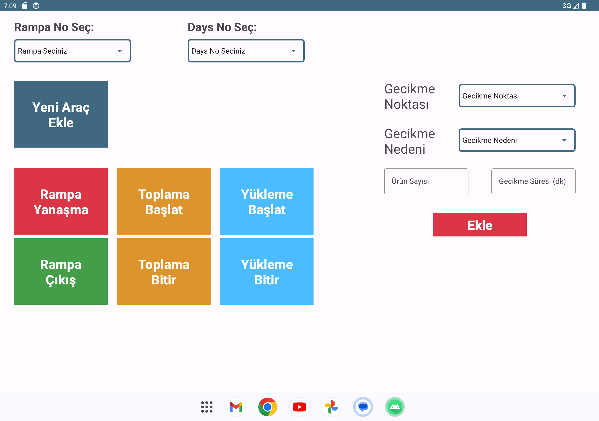

# Movus Tablet

This is an Android application project built using Kotlin for warehouse ramp personals. 
The app allows users to perform various actions related to vehicle management and logging. It includes features such as adding new vehicles, tracking vehicle activities, and managing delays.

## Features

- **Adding New Vehicle**: Users can add new vehicles to the system by filling out relevant information such as license plate, cargo quantity, and personnel details.
- **Vehicle Actions**: Users can perform different actions related to vehicle management, including ramp approach, cargo collection, cargo loading, and vehicle exit.
- **Delay Logging**: Users can log delays with reasons and durations for better tracking and reporting.
- **Networking**: The app uses HTTP requests to communicate with a server for data retrieval and logging.

## Screenshots

  

